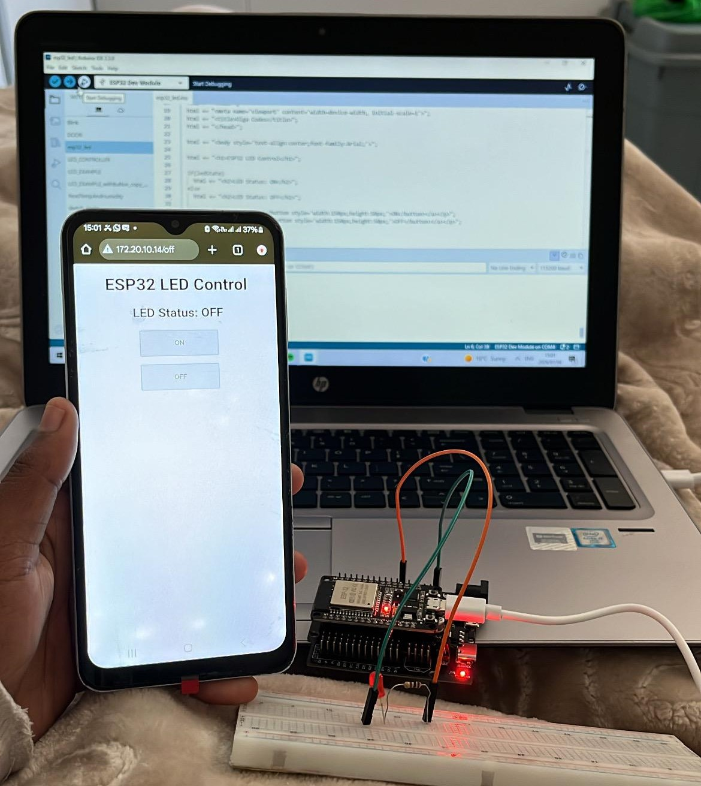

# 💡 ESP32 Wi-Fi LED Control

A beginner-friendly ESP32 IoT project that allows an LED to be controlled remotely through a web browser over Wi-Fi.

The ESP32 connects to a Wi-Fi network and runs a simple web server. A webpage hosted by the ESP32 provides **ON** and **OFF** buttons that control an LED connected to one of its GPIO pins.

---


## 📌 Project Overview

This project is designed to introduce the fundamentals of:

* ESP32 programming
* Wi-Fi connectivity
* ESP32 web servers
* HTML web pages
* GPIO control
* Basic IoT concepts
* Controlling hardware from a web browser

The ESP32 acts as both the **Wi-Fi client** and the **web server**. Once connected to the network, users can access the ESP32's IP address from a phone, laptop, or other device connected to the same Wi-Fi network.

---

## 🧰 Components Required

| Component               | Quantity |
| ----------------------- | -------: |
| ESP32 Development Board |        1 |
| LED                     |        1 |
| 220 Ω resistor          |        1 |
| Breadboard              |        1 |
| Jumper wires            |      2–3 |
| USB cable               |        1 |

### Alternative Resistors

If a 220 Ω resistor is unavailable, suitable alternatives include:

* 330 Ω ⭐ Recommended
* 470 Ω
* 150 Ω
* 1 kΩ

A resistor should always be used to limit the current flowing through the LED.

---

## 🔌 Circuit Connection

The LED is connected to **GPIO 2**.

```text
ESP32 GPIO 2
     │
     │
   220 Ω
  Resistor
     │
     │
    LED
     │
     │
    GND
```

### LED Polarity

* **Long leg** → Anode (+)
* **Short leg** → Cathode (-)

Connect the longer LED leg to GPIO 2 **through the resistor** and the shorter leg to GND.

---

## 💻 Software Requirements

You will need:

* Arduino IDE
* ESP32 board package for Arduino IDE
* ESP32 development board
* A 2.4 GHz Wi-Fi network

### Arduino IDE

Download and install Arduino IDE from the official Arduino website.

During setup, install the **ESP32 board package by Espressif Systems** through the Arduino Boards Manager.

---

## 📂 Project Structure

```text
Wi-Fi-LED-Control/
│
├── WiFi_LED_Control.ino
└── README.md
```

---

## ⚙️ How the Project Works

The ESP32 performs the following steps:

```text
        START
          │
          ▼
   Initialize GPIO
          │
          ▼
   Connect to Wi-Fi
          │
          ▼
   Start Web Server
          │
          ▼
    User opens webpage
          │
          ▼
    ┌─────┴─────┐
    │           │
   ON          OFF
    │           │
    ▼           ▼
LED ON       LED OFF
```

---

## 📝 Arduino Code

```cpp
#include <WiFi.h>
#include <WebServer.h>

const char* ssid = "YOUR_WIFI_NAME";
const char* password = "YOUR_WIFI_PASSWORD";

WebServer server(80);

const int ledPin = 2;

bool ledState = false;

void handleRoot() {

  String html = "<!DOCTYPE html><html>";
  html += "<head>";
  html += "<meta name='viewport' content='width=device-width, initial-scale=1'>";
  html += "<title>ESP32 LED Control</title>";
  html += "</head>";

  html += "<body style='text-align:center;font-family:Arial;'>";

  html += "<h1>ESP32 LED Control</h1>";

  if (ledState)
    html += "<h2>LED Status: ON</h2>";
  else
    html += "<h2>LED Status: OFF</h2>";

  html += "<p><a href='/on'><button style='width:150px;height:50px;'>ON</button></a></p>";
  html += "<p><a href='/off'><button style='width:150px;height:50px;'>OFF</button></a></p>";

  html += "</body></html>";

  server.send(200, "text/html", html);
}

void handleOn() {
  digitalWrite(ledPin, HIGH);
  ledState = true;
  handleRoot();
}

void handleOff() {
  digitalWrite(ledPin, LOW);
  ledState = false;
  handleRoot();
}

void setup() {

  Serial.begin(115200);

  pinMode(ledPin, OUTPUT);

  WiFi.begin(ssid, password);

  Serial.print("Connecting");

  while (WiFi.status() != WL_CONNECTED) {
    delay(500);
    Serial.print(".");
  }

  Serial.println();
  Serial.println("WiFi Connected");

  Serial.print("IP Address: ");
  Serial.println(WiFi.localIP());

  server.on("/", handleRoot);
  server.on("/on", handleOn);
  server.on("/off", handleOff);

  server.begin();

  Serial.println("Web Server Started");
}

void loop() {
  server.handleClient();
}
```

---

## 🔑 Configure Your Wi-Fi

Before uploading the program, change:

```cpp
const char* ssid = "YOUR_WIFI_NAME";
const char* password = "YOUR_WIFI_PASSWORD";
```

For example:

```cpp
const char* ssid = "MyWiFi";
const char* password = "mypassword123";
```

> **Important:** The ESP32 must connect to a **2.4 GHz Wi-Fi network**. It cannot connect to a 5 GHz-only network.

---

## 🚀 Uploading the Program

1. Connect the ESP32 to your computer using a USB cable.
2. Open Arduino IDE.
3. Open `WiFi_LED_Control.ino`.
4. Select the correct ESP32 board.
5. Select the correct COM port.
6. Click **Upload**.
7. Open the Serial Monitor.
8. Set the baud rate to **115200**.

You should see:

```text
Connecting......
WiFi Connected
IP Address: 192.168.1.xxx
Web Server Started
```

---

## 🌐 Accessing the Webpage

Once the ESP32 connects to Wi-Fi, the Serial Monitor will display its IP address.

For example:

```text
IP Address: 192.168.1.105
```

Open a web browser on a device connected to the **same Wi-Fi network** and enter:

```text
http://192.168.1.105
```

Replace the IP address with the one displayed by your ESP32.

You should see:

```text
ESP32 LED Control

LED Status: OFF

[ ON ]

[ OFF ]
```

Pressing **ON** turns the LED on, while pressing **OFF** turns it off.

---

## 🧠 Understanding the Code

### Wi-Fi Library

```cpp
#include <WiFi.h>
```

This library allows the ESP32 to connect to Wi-Fi networks.

### Web Server Library

```cpp
#include <WebServer.h>
```

This allows the ESP32 to create and manage a web server.

### GPIO Configuration

```cpp
const int ledPin = 2;
```

GPIO 2 is used to control the LED.

### Turning the LED ON

```cpp
digitalWrite(ledPin, HIGH);
```

This sends a HIGH signal to GPIO 2, turning the LED on.

### Turning the LED OFF

```cpp
digitalWrite(ledPin, LOW);
```

This sends a LOW signal to GPIO 2, turning the LED off.

### Webpage Routes

The ESP32 responds to three URLs:

```text
/
```

Displays the webpage.

```text
/on
```

Turns the LED on.

```text
/off
```

Turns the LED off.

---

## 🛠️ Troubleshooting

### ESP32 keeps showing:

```text
Connecting......
```

Check:

* Wi-Fi name and password.
* Wi-Fi signal strength.
* Make sure the network has a 2.4 GHz band enabled.
* Try restarting the ESP32.
* Try connecting to a 2.4 GHz phone hotspot.

### Webpage does not open

Check that:

* ESP32 successfully connected to Wi-Fi.
* You entered the correct IP address.
* Your phone/laptop is connected to the same Wi-Fi network.

### LED does not turn on

Check:

* LED polarity.
* Resistor connection.
* GPIO 2 connection.
* GND connection.
* Breadboard connections.

---

## 🔐 Security Note

This project is intended for learning and operates on a local network.

The webpage does not include authentication, meaning anyone connected to the same network who knows the ESP32's IP address may be able to control the LED.

For a real IoT deployment, additional security measures such as authentication and encrypted communication should be implemented.

---

## 🎯 Learning Outcomes

After completing this project, you should understand:

* How an ESP32 connects to Wi-Fi.
* How an ESP32 obtains an IP address.
* What an IP address is.
* How a web server works.
* How HTML can be served from an ESP32.
* How browser requests can control physical hardware.
* How GPIO pins control electronic components.
* The basic architecture of an IoT device.

---

## 🔮 Future Improvements

Possible upgrades include:

* [ ] Add multiple LEDs.
* [ ] Add LED brightness control.
* [ ] Add a modern responsive webpage.
* [ ] Add buttons with real-time status indicators.
* [ ] Add a DHT11/DHT22 temperature sensor.
* [ ] Display temperature on the webpage.
* [ ] Control a relay.
* [ ] Add password authentication.
* [ ] Add MQTT communication.
* [ ] Control the ESP32 remotely through the internet.

---


## 📚 Skills Practiced

**Hardware**

`ESP32` `GPIO` `LED` `Resistors` `Breadboard`

**Software**

`Arduino IDE` `C++` `HTML`

**Networking**

`Wi-Fi` `IP Address` `HTTP` `Web Server`

**IoT**

`ESP32` `Web-based Control` `Embedded Systems`

---

## 👩🏽‍💻 Author

**Refilwe Masupe**

This project is part of my **ESP32 Projects** collection, where I am building practical projects to develop my skills in embedded systems, IoT, electronics, programming, and hardware-software integration.

---

## ⭐ Project Status

**Status:** 🟢 Completed / Beginner Project

**Difficulty:** ⭐ Beginner

**Platform:** ESP32

**Interface:** Web Browser

**Communication:** Wi-Fi / HTTP
