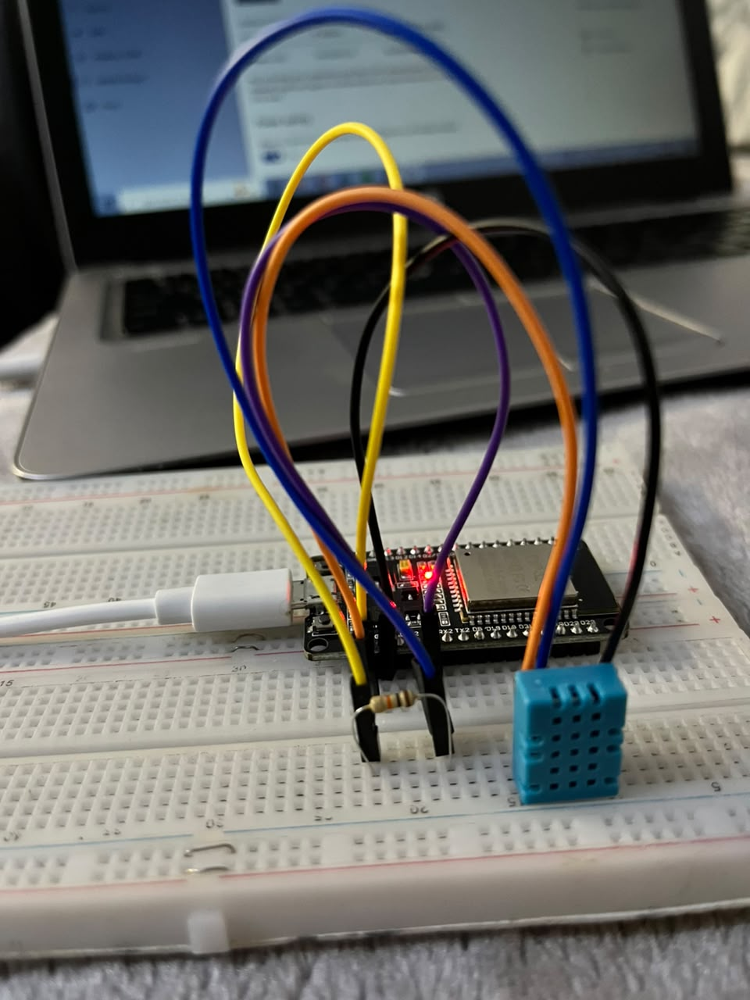
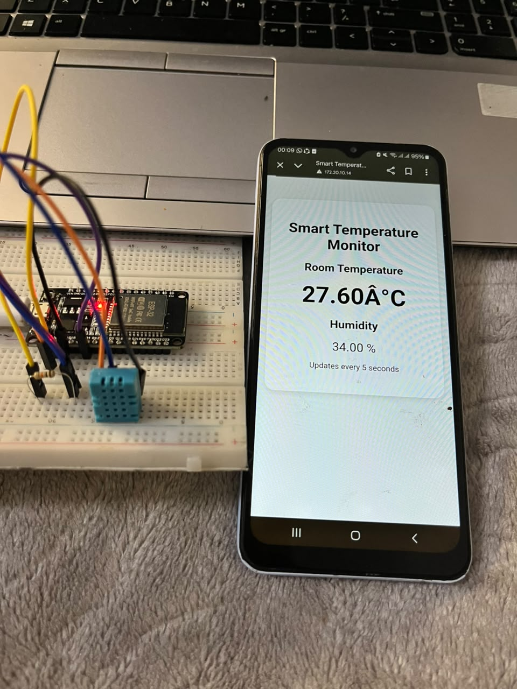

# 🌡️ Smart Temperature Monitor

An ESP32-based IoT project that measures **room temperature and humidity** using a DHT11 or DHT22 sensor and displays the readings on a webpage hosted by the ESP32.

## 📌 Project Overview

The **Smart Temperature Monitor** demonstrates how an ESP32 can collect environmental data from a sensor and make that information accessible through a web browser over Wi-Fi.

The ESP32 acts as a **web server**, allowing a phone, laptop, or other device connected to the same Wi-Fi network to view the current temperature and humidity.

## ✨ Features

* 🌡️ Measures room temperature
* 💧 Measures humidity
* 📡 Connects to Wi-Fi
* 🌐 Hosts a webpage directly from the ESP32
* 🔄 Automatically refreshes readings every 5 seconds
* 📱 Accessible from a phone or computer
* 🛠️ Supports DHT11 or DHT22 sensors

## 🧰 Components

* ESP32 DevKit V1
* DHT11 or DHT22 temperature and humidity sensor
* Breadboard
* Jumper wires
* USB cable
* 10 kΩ resistor for a bare 4-pin DHT sensor

## 🔌 Circuit Connections

The project uses **GPIO 4** as the DHT sensor data pin.

| DHT Sensor | ESP32         |
| ---------- | ------------- |
| VCC        | 3.3V          |
| DATA       | GPIO 4        |
| GND        | GND           |
| NC         | Not connected |

For a bare 4-pin DHT11/DHT22, connect a **10 kΩ pull-up resistor between DATA and 3.3V**.

```text
                 10 kΩ
3.3V ──────────/\/\/\──────┐
                           │
DHT DATA ──────────────────┼──── GPIO 4
                           │

DHT VCC ─────────────────────── 3.3V
DHT GND ─────────────────────── GND
```


## 💻 Software Requirements

* Arduino IDE
* ESP32 board package for Arduino IDE
* DHT sensor library by Adafruit
* Adafruit Unified Sensor library

### Install the Libraries

In Arduino IDE:

**Tools → Manage Libraries**

Search for:

```text
DHT sensor library
```

Install:

* **DHT sensor library by Adafruit**
* **Adafruit Unified Sensor**

## ⚙️ Configuration

Open the Arduino sketch and enter your Wi-Fi credentials:

```cpp
const char* ssid = "YOUR_WIFI_NAME";
const char* password = "YOUR_WIFI_PASSWORD";
```

For a DHT11:

```cpp
#define DHTTYPE DHT11
```

For a DHT22:

```cpp
#define DHTTYPE DHT22
```

## 🚀 How to Run the Project

### 1. Connect the circuit

Connect the DHT11/DHT22 to the ESP32 according to the wiring diagram above.

### 2. Open the Arduino project

Open the `.ino` file in Arduino IDE.

### 3. Configure Wi-Fi

Enter your Wi-Fi network name and password in the code.

### 4. Select your ESP32 board

In Arduino IDE, select the appropriate ESP32 board and COM port.

### 5. Upload the code

Upload the program to the ESP32.

### 6. Open Serial Monitor

Set the Serial Monitor to:

```text
115200 baud
```

After connecting to Wi-Fi, the ESP32 will display its IP address:

```text
Wi-Fi connected!
ESP32 IP address: 192.168.1.25
Web server started!
```

### 7. Open the webpage

Connect your phone or computer to the **same Wi-Fi network** as the ESP32.

Open a web browser and enter the IP address shown in Serial Monitor:

```text
192.168.1.25
```

Your webpage should display the current temperature and humidity.

## 🌐 Example Webpage

```text
┌─────────────────────────────────┐
│    Smart Temperature Monitor │
│                                 │
│       Room Temperature          │
│                                 │
│            24.6 °C              │
│                                 │
│           Humidity               │
│                                 │
│             52 %                │
│                                 │
│      Updates every 5 seconds    │
└─────────────────────────────────┘
```

## 🔄 How It Works

```text
       DHT11 / DHT22
             │
             │ Temperature
             │ Humidity
             ▼
          ESP32
             │
             │ Wi-Fi
             ▼
       Web Server
             │
             ▼
     Phone / Laptop
             │
             ▼
      Web Browser
```



The ESP32 reads the temperature and humidity from the DHT sensor and creates an HTML webpage containing the readings.

The webpage automatically refreshes every **5 seconds** to display updated measurements.

## 📁 Project Structure

```text
Smart-Temperature-Monitor/
│
├── Smart_Temperature_Monitor/
│   └── Smart_Temperature_Monitor.ino
│
├── images/
│   ├── circuit.png
│   └── webpage.png
│
└── README.md
```

## 🧪 Troubleshooting

### "Failed to read from DHT sensor!"

Check:

* DHT DATA is connected to GPIO 4.
* VCC is connected to 3.3V.
* GND is connected to GND.
* A 10 kΩ pull-up resistor is connected between DATA and 3.3V for a bare sensor.
* The correct sensor type is selected in the code.
* Allow at least 2 seconds between sensor readings.

### ESP32 won't connect to Wi-Fi

Check:

* Wi-Fi name is correct.
* Wi-Fi password is correct.
* ESP32 is within range of the router.
* Your network supports the ESP32's Wi-Fi requirements.
* The phone/laptop is connected to the same network as the ESP32.

### Webpage doesn't open

Check the IP address printed in Serial Monitor.

Make sure you enter the address exactly, for example:

```text
192.168.1.25
```

Also make sure your phone/computer and ESP32 are connected to the same Wi-Fi network.

## 📚 What I Learned

This project helped me practice:

* ESP32 programming
* Digital sensor interfacing
* DHT11/DHT22 sensors
* Temperature and humidity measurement
* Wi-Fi communication
* HTTP
* HTML and CSS
* ESP32 web servers
* IoT fundamentals
* Debugging hardware and software

## 🔮 Future Improvements

Possible upgrades include:

* 📊 Add temperature graphs
* 📱 Improve the webpage for mobile devices
* ⚡ Add an LED warning when the temperature is too high
* ☁️ Send data to ThingSpeak or another IoT platform
* 💾 Store historical temperature readings
* 📈 Display minimum and maximum temperatures
* 🔔 Add temperature alerts
* 🌐 Create a more advanced IoT dashboard

## 👩🏽‍💻 Author

**Refilwe Masupe**

Electrical Engineering Student
ESP32 & IoT Projects

## ⭐ Project Goal

The goal of this project is to develop practical skills in **embedded systems, IoT, sensors, Wi-Fi communication, and web-based monitoring** using the ESP32.
