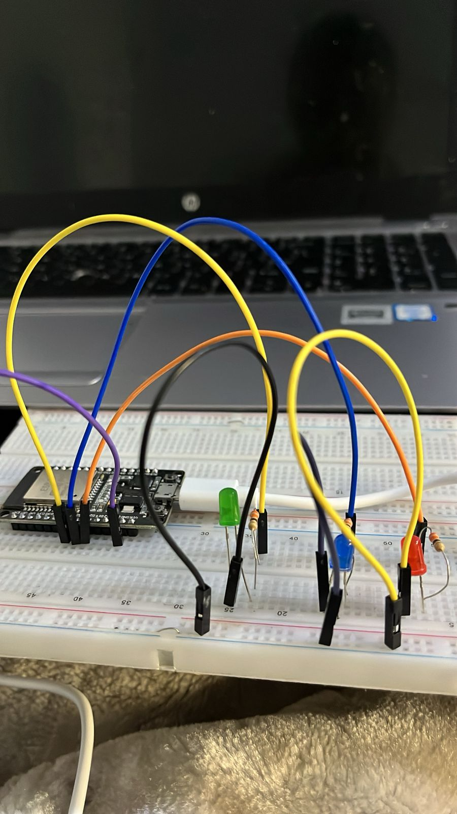

# 🏠 ESP32 Bluetooth Home Automation System

A simple Bluetooth-based home automation project built using an **ESP32 DevKit V1**. The system allows a smartphone to wirelessly control multiple devices using the ESP32's built-in Bluetooth.

For this prototype, **three LEDs represent household appliances** such as lights and a fan. The project can later be upgraded using relay modules to control suitable external loads.

---

## 📌 Project Overview

The ESP32 receives commands from a smartphone through Bluetooth and uses these commands to switch GPIO outputs ON or OFF.

The three LEDs represent:

* 💡 Living Room Light
* 🌀 Fan
* 💡 Bedroom Light

The user can control each device individually or switch all devices ON/OFF at once.

---

## 🎯 Objectives

The objectives of this project are to:

* Learn how to use the ESP32's built-in Bluetooth.
* Establish wireless communication between an ESP32 and a smartphone.
* Control ESP32 GPIO pins using Bluetooth commands.
* Create a simple smartphone-based home automation controller.
* Understand the basic principles behind wireless home automation systems.

---

## 🧰 Components Required

| Component                | Quantity |
| ------------------------ | -------: |
| ESP32 DevKit V1          |        1 |
| LEDs                     |        3 |
| 220 Ω or 330 Ω resistors |        3 |
| Breadboard               |        1 |
| Jumper wires             |  Several |
| Smartphone               |        1 |
| USB cable                |        1 |

> No external Bluetooth module such as the HC-05 or HC-06 is required because the ESP32 has built-in Bluetooth.

---

## 🔌 Circuit Connections

The following GPIO pins are used:

| Device                | ESP32 GPIO |
| --------------------- | ---------: |
| Living Room Light LED |    GPIO 25 |
| Fan LED               |    GPIO 26 |
| Bedroom Light LED     |    GPIO 27 |

### LED Connections

Each LED must have its own current-limiting resistor.

```text
GPIO 25 ── 220Ω/330Ω ── LED 1 ── GND

GPIO 26 ── 220Ω/330Ω ── LED 2 ── GND

GPIO 27 ── 220Ω/330Ω ── LED 3 ── GND
```

For each LED:

* **Long leg (anode)** → resistor → ESP32 GPIO
* **Short leg (cathode)** → GND

> ⚠️ Do not connect an LED directly to an ESP32 GPIO without a current-limiting resistor.

---

## 📡 How the System Works

The smartphone connects to the ESP32 using Bluetooth.

The user presses a button in a Bluetooth serial terminal application. Each button sends a specific text command to the ESP32.

For example:

```text
LIGHT_ON
```

The ESP32 receives the command and switches GPIO 25 HIGH.

```text
Smartphone
     │
     │ Bluetooth
     ▼
┌──────────┐
│  ESP32   │
└────┬─────┘
     │
 ┌───┼────────┐
 ▼   ▼        ▼
💡   🌀       💡
Light Fan   Bedroom
```

---

## 📱 Bluetooth Commands

| Command       | Action                |
| ------------- | --------------------- |
| `LIGHT_ON`    | Living room light ON  |
| `LIGHT_OFF`   | Living room light OFF |
| `FAN_ON`      | Fan ON                |
| `FAN_OFF`     | Fan OFF               |
| `BEDROOM_ON`  | Bedroom light ON      |
| `BEDROOM_OFF` | Bedroom light OFF     |
| `ALL_ON`      | All devices ON        |
| `ALL_OFF`     | All devices OFF       |

---

## 💻 ESP32 Code

```cpp
#include "BluetoothSerial.h"

BluetoothSerial SerialBT;

#define LIVING_LIGHT 25
#define FAN 26
#define BEDROOM_LIGHT 27

void setup() {

  Serial.begin(115200);

  pinMode(LIVING_LIGHT, OUTPUT);
  pinMode(FAN, OUTPUT);
  pinMode(BEDROOM_LIGHT, OUTPUT);

  // All devices OFF at startup
  digitalWrite(LIVING_LIGHT, LOW);
  digitalWrite(FAN, LOW);
  digitalWrite(BEDROOM_LIGHT, LOW);

  // Start Bluetooth
  SerialBT.begin("ESP32_Home_Automation");

  Serial.println("===============================");
  Serial.println(" ESP32 HOME AUTOMATION SYSTEM");
  Serial.println("===============================");
  Serial.println("Bluetooth started.");
  Serial.println("Device: ESP32_Home_Automation");
  Serial.println("System Ready!");
}

void loop() {

  if (SerialBT.available()) {

    String command = SerialBT.readStringUntil('\n');
    command.trim();

    Serial.print("Command received: ");
    Serial.println(command);

    if (command == "LIGHT_ON") {

      digitalWrite(LIVING_LIGHT, HIGH);

      SerialBT.println("Living Room Light: ON");
      Serial.println("Living Room Light: ON");
    }

    else if (command == "LIGHT_OFF") {

      digitalWrite(LIVING_LIGHT, LOW);

      SerialBT.println("Living Room Light: OFF");
      Serial.println("Living Room Light: OFF");
    }

    else if (command == "FAN_ON") {

      digitalWrite(FAN, HIGH);

      SerialBT.println("Fan: ON");
      Serial.println("Fan: ON");
    }

    else if (command == "FAN_OFF") {

      digitalWrite(FAN, LOW);

      SerialBT.println("Fan: OFF");
      Serial.println("Fan: OFF");
    }

    else if (command == "BEDROOM_ON") {

      digitalWrite(BEDROOM_LIGHT, HIGH);

      SerialBT.println("Bedroom Light: ON");
      Serial.println("Bedroom Light: ON");
    }

    else if (command == "BEDROOM_OFF") {

      digitalWrite(BEDROOM_LIGHT, LOW);

      SerialBT.println("Bedroom Light: OFF");
      Serial.println("Bedroom Light: OFF");
    }

    else if (command == "ALL_ON") {

      digitalWrite(LIVING_LIGHT, HIGH);
      digitalWrite(FAN, HIGH);
      digitalWrite(BEDROOM_LIGHT, HIGH);

      SerialBT.println("All Devices: ON");
      Serial.println("All Devices: ON");
    }

    else if (command == "ALL_OFF") {

      digitalWrite(LIVING_LIGHT, LOW);
      digitalWrite(FAN, LOW);
      digitalWrite(BEDROOM_LIGHT, LOW);

      SerialBT.println("All Devices: OFF");
      Serial.println("All Devices: OFF");
    }

    else {

      SerialBT.println("Unknown command!");
      Serial.println("Unknown command!");
    }
  }
}
```

---

## 📲 Smartphone Setup

A Bluetooth serial terminal application can be used to communicate with the ESP32.

### 1. Upload the Program

Upload the ESP32 program and open the Serial Monitor at:

```text
115200 baud
```

The ESP32 should display:

```text
Bluetooth started.
Device: ESP32_Home_Automation
System Ready!
```

### 2. Connect the Smartphone

Turn on Bluetooth and connect to:

```text
ESP32_Home_Automation
```

Then connect to the ESP32 from the Bluetooth terminal application.

### 3. Create Control Buttons

Create buttons/macros for:

```text
💡 Living ON       → LIGHT_ON
💡 Living OFF      → LIGHT_OFF

🌀 Fan ON          → FAN_ON
🌀 Fan OFF         → FAN_OFF

💡 Bedroom ON      → BEDROOM_ON
💡 Bedroom OFF     → BEDROOM_OFF

🟢 ALL ON          → ALL_ON
🔴 ALL OFF         → ALL_OFF
```

Configure the application to append a newline (`\n`) to each command.

---

## 🧪 Testing

Test each device individually.

For example, sending:

```text
LIGHT_ON
```

should switch the LED connected to GPIO 25 ON.

Sending:

```text
LIGHT_OFF
```

should switch it OFF.

To test the entire system, send:

```text
ALL_ON
```

All three LEDs should turn ON.

Then send:

```text
ALL_OFF
```

All LEDs should turn OFF.

---


### Breadboard Circuit

```markdown

```

## 🚀 Future Improvements

This project can be expanded by adding:

* Relay modules for controlling suitable external loads
* Bluetooth Low Energy (BLE) support
* Custom Android application
* Temperature and humidity monitoring
* Automatic fan control
* Motion sensors
* Voice control
* Wi-Fi and Bluetooth control
* Web-based dashboard
* Device status feedback
* Home Assistant integration

---

## ⚠️ Safety

The current prototype uses low-voltage LEDs to represent household appliances.

Do not connect 230 V AC household appliances directly to the ESP32, breadboard, or GPIO pins.

Properly rated relay/contactor hardware, isolation, enclosures, protection and safe mains wiring practices are required when working with mains electricity.

---

## 📚 What I Learned

Through this project, I gained practical experience with:

* ESP32 programming
* Bluetooth communication
* GPIO control
* Breadboard prototyping
* Serial communication
* Smartphone-to-microcontroller communication
* Command-based control systems
* Basic home automation concepts

---

## 👤 Author

**Refilwe Masupe**

Electrical Engineering Student
Interested in Embedded Systems, IoT, Robotics and Automation

---

## ⭐ Project Status

**Completed — Bluetooth LED Home Automation Prototype**

Future development will focus on expanding the prototype into a more advanced smart home control system.
